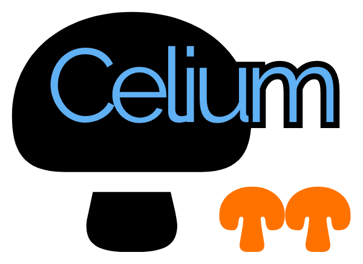

# bitar

[](https://app.codacy.com/gh/ljishen/bitar?utm_source=github.com&utm_medium=referral&utm_content=ljishen/bitar&utm_campaign=Badge_Grade_Settings)
[](https://github.com/marketplace/actions/super-linter)
[](LICENSE)
[](https://zenodo.org/badge/latestdoi/490108576)

<!-- markdownlint-disable-next-line no-inline-html -->

Bitar is a C++ library to simplify accessing hardware compression/decompression accelerators.

## Features

- Zero-copy of data input and output
- Synchronous and asynchronous operations
- Execution in both the host and the embedded environment
- Multi-core and multi-device support
- No sudo permission requirement

## Prerequisites

- Linux (with kernel >= 4.4) or FreeBSD
- For Linux, glibc >= 2.7 (reported by `ldd --version`)
- GCC >= 9 (C++17 compliant compiler)
- [DPDK](https://github.com/DPDK/dpdk) >= v21.11 (can be installed via vcpkg)
- [Apache Arrow](https://github.com/apache/arrow) >= 7.0.0 (build automatically
  if not found)

## Supported Hardware

- [NVIDIA BLUEFIELD-2 DPU](https://www.nvidia.com/content/dam/en-zz/Solutions/Data-Center/documents/datasheet-nvidia-bluefield-2-dpu.pdf)

## Integration

Bitar can be easily installed and integrated via
[vcpkg](https://github.com/microsoft/vcpkg)

```bash
vcpkg install bitar
```

## Development

- The DPDK library will be built from source by vcpkg if `dpdk_ROOT` is not
  specified.

- The Arrow parquet library is required if `BITAR_BUILD_APPS` is `ON`.
  Otherwise, having the Arrow library is sufficient.

- Loading the Arrow parquet library will create a CMake target for the arrow and
  parquet library, respectively.

- Use `Parquet_ROOT` to specify the directory path that contains the file
  `ParquetConfig.cmake`. For system-installed Arrow library on Ubuntu, the
  typical directory path would be `/usr/lib/$(uname -m)-linux-gnu/cmake/arrow`.

- Use `Arrow_ROOT` to specify the installation prefix of the Arrow library if it
  is not installed at the default location. By default, the system-installed
  Arrow library will be at `/usr`.

- If the Arrow library is not found, or it is found but the parquet library is
  not found when needed, the Arrow library will be built from source.

```bash
$ # Reserve hugepages
$ sudo sh -c 'echo 1024 > /sys/devices/system/node/node0/hugepages/hugepages-2048kB/nr_hugepages'
$ # On NUMA machines, we may need
$ # sudo sh -c 'echo 1024 > /sys/devices/system/node/node1/hugepages/hugepages-2048kB/nr_hugepages'

$ CC=clang CXX=clang++ cmake -S . -B ./build-$(uname -m) -G Ninja \
[-Ddpdk_ROOT:PATH=<dpdk-install-prefix>] \
[-DParquet_ROOT:PATH=<parquet-cmake-config-file-dir>] \
[-DArrow_ROOT:PATH=<arrow-install-prefix>] \
-DBITAR_BUILD_APPS:BOOL=ON -DBITAR_BUILD_TESTS:BOOL=ON \
-DENABLE_DEVELOPER_MODE:BOOL=ON -DCMAKE_BUILD_TYPE:BOOL=Debug

$ cmake --build ./build-$(uname -m)
$ cmake --install ./build-$(uname -m) --prefix <install-prefix>

# LD_LIBRARY_PATH can be omitted if DPDK is built from source via vcpkg
$ LD_LIBRARY_PATH=<dpdk-install-prefix>/lib/$(uname -m)-linux-gnu:<dpdk-install-prefix>/lib64:$LD_LIBRARY_PATH \
./build-$(uname -m)/apps/demo_app --in-memory -l 1-3 -a <device-pci-id>,class=compress -- \
[--bytes <size-to-read-from-file>] --file <file> [--mode <file-read-mode>] [--help]
```

### Advanced CMake Configuration Options

- `BITAR_FETCHCONTENT_OVERWRITE_CONFIGURATION`: set this option to `OFF` to have
  separate debug and release builds without overwriting each others
  configurations (default: `ON`)

- `VCPKG_ROOT`: the prefix to an installed vcpkg instance (install automatically
  if not specified)

- `BITAR_BUILD_ARROW`: set this option to `ON` to force building the Arrow
  dependency from source (default: `OFF`)

- `BITAR_ARROW_GIT_REPOSITORY`: the git repository to fetch the Arrow source
  (default: the official repository)

- `BITAR_ARROW_GIT_TAG`: use the source at the git branch, tag or commit hash of
  the Arrow repository for building when needed

- `BITAR_INSTALL_ARROW`: install the Arrow library as part of the cmake
  installation process if Arrow is built by this project (default: `OFF`)

- Any
  [Arrow supported CMake options](https://github.com/apache/arrow/blob/apache-arrow-8.0.1/cpp/cmake_modules/DefineOptions.cmake),
  e.g., `ARROW_WITH_LZ4`, `ARROW_WITH_ZSTD`, and `ARROW_WITH_SNAPPY`.

## Known Issues

- (July 23, 2022) DPDK mistakenly assumes the support of `aes`, `pmull`, `sha1`,
  and `sha2` CPU flags on crypto-disabled BlueField-2 DPUs (e.g.,
  `MBF2H516A-CENO_Ax`, the one on the CloudLab r7525 machine) with **LLVM
  Clang**, resulting in the following error when executing a program compiled
  with bitar
  ([relevant code](https://github.com/DPDK/dpdk/blob/v22.07/config/arm/meson.build#L652-L655)):

  ```bash
  ERROR: This system does not support "AES".
  Please check that RTE_MACHINE is set correctly.
  ```

  There is no such problem when DPDK is compiled with GCC. Note that bitar can
  still be compiled with Clang and linked with DPDK that is compiled with GCC.
