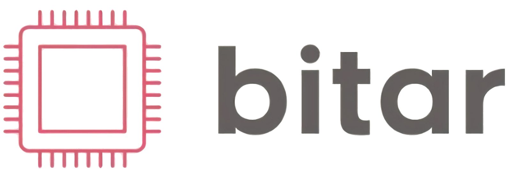

# bitar

[](https://github.com/marketplace/actions/super-linter)
[](LICENSE)

<!-- markdownlint-disable-next-line no-inline-html -->

Bitar is a C++ library to simplify accessing hardware compression/decompression accelerators.

---

## Prerequisites

- Linux (with kernel >= 4.4) or FreeBSD
- For Linux, glibc >= 2.7 (reported by `ldd --version`)
- [DPDK](https://github.com/DPDK/dpdk) >= v21.11 (can be installed via vcpkg)
- [Apache Arrow](https://github.com/apache/arrow) >= 7.0.0 (can be installed via vcpkg)

## Supported Hardware

- [NVIDIA BLUEFIELD-2 DPU](https://www.nvidia.com/content/dam/en-zz/Solutions/Data-Center/documents/datasheet-nvidia-bluefield-2-dpu.pdf)

## Integration

Bitar can be easily installed and integrated via vcpkg
```bash
vcpkg install bitar
```

## Development

```bash
$ # Reserve hugepages
$ sudo sh -c 'echo 1024 > /sys/devices/system/node/node0/hugepages/hugepages-2048kB/nr_hugepages'
$ # On a NUMA machine, we need
$ # sudo sh -c 'echo 1024 > /sys/devices/system/node/node1/hugepages/hugepages-2048kB/nr_hugepages'

$ # If DPDK_ROOT or ARROW_ROOT is omitted, the corresponding libraries will be install via vcpkg.
$ CC=clang CXX=clang++ cmake -S . -B ./build-$(uname -m) -G Ninja \
[-DDPDK_ROOT:PATH=<dpdk_install_prefix>] [-DARROW_ROOT:PATH=<arrow_install_prefix>] \
-DCMAKE_BUILD_TYPE:BOOL=Debug -DENABLE_DEVELOPER_MODE:BOOL=ON -DFEATURE_TESTS:BOOL=ON

$ cmake --build ./build-$(uname -m)

# Omit LD_LIBRARY_PATH if DPDK is installed via vcpkg
$ LD_LIBRARY_PATH=<dpdk_install_prefix>/lib/$(uname -m)-linux-gnu:<dpdk/install/prefix>/lib64:$LD_LIBRARY_PATH \
./build-$(uname -m)/apps/demo_app --in-memory -l 1-3 -a <device_pci_id>,class=compress -- \
--file <file> --bytes <size_to_read_from_file>
```
